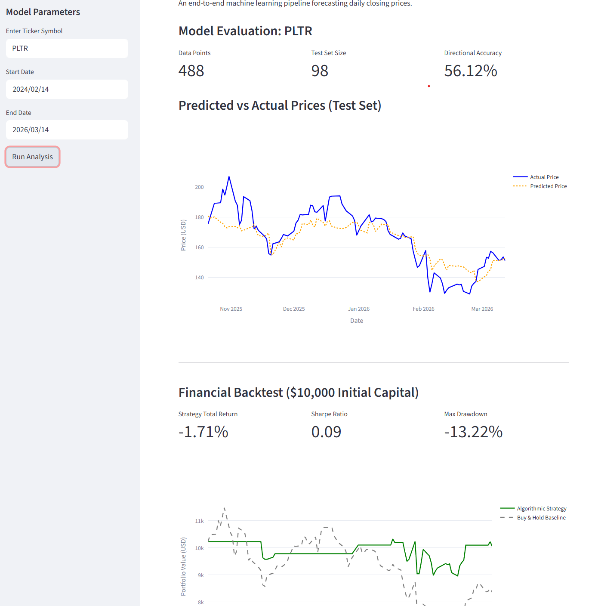
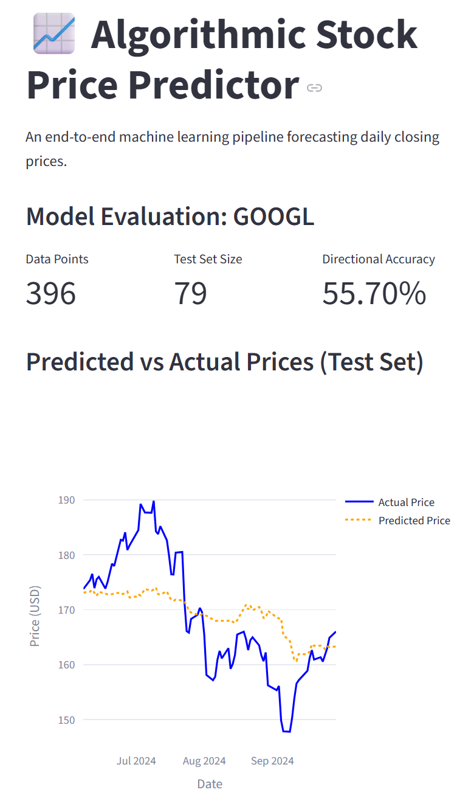
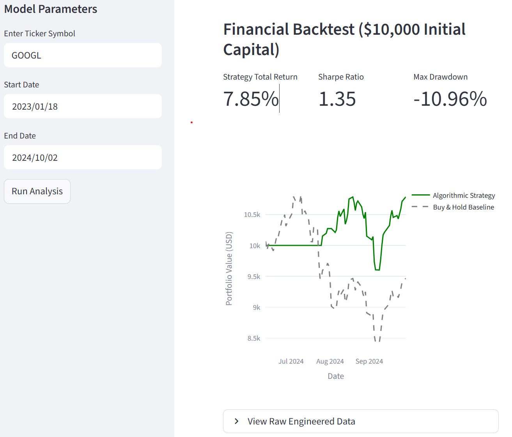

# QuantForecast: Basic End-to-End Algorithmic Trading Pipeline

**QuantForecast** is a modular machine learning pipeline designed to forecast equity price movements and evaluate trading strategies through rigorous backtesting. Moving beyond static notebooks, this project implements a production-style architecture featuring automated data ingestion, advanced feature engineering, and a stateful trading engine.


---

##  Key Features

* **Live Data Ingestion:** Integrated with the `yfinance` API for real-time market data retrieval across global tickers.
* **Advanced Feature Engineering:** Automated calculation of alpha-generating indicators including **RSI, MACD, and Bollinger Bands** via `pandas_ta`.
* **Gradient Boosted Forecasting:** Implements **XGBoost** for non-linear time-series prediction, optimized for tabular financial data.
* **Stateful Backtesting:** A custom-built engine that simulates realistic trading scenarios, tracking cash, share positions, and cumulative equity growth.
* **Institutional Metrics:** Automated calculation of the **Sharpe Ratio**, **Maximum Drawdown**, and **Directional Accuracy**.
* **Interactive Dashboard:** A professional UI built with **Streamlit** and **Plotly** for real-time visual analysis of performance vs. market baselines.

<p align="center">
  
  
</p>


---

##  System Architecture

The project utilizes a modular "Source-Root" design pattern to ensure clean separation of concerns:

| Module | Responsibility |
| :--- | :--- |
| `src/data_loader.py` | API interactions and MultiIndex data flattening. |
| `src/features.py` | Quantitative logic for technical indicator generation. |
| `src/model.py` | XGBoost training and inference with chronological splitting. |
| `src/backtest.py` | Financial engine for P&L and risk-adjusted metrics. |
| `dashboard.py` | Entry point for the Streamlit web interface. |

---

## 📈 Technical Insights & Challenges

This project served as a deep dive into the nuances of financial machine learning:

* **Hyperparameter Tuning:** Explored `RandomizedSearchCV` with `TimeSeriesSplit`. Discovered that default "factory" settings often generalize better in non-stationary markets, avoiding the trap of overfitting to historical noise.
* **Regime Adaptation:** Observed how the model adapts to different market conditions, ranging from "Permabull" states in strong uptrends to defensive cash positions during high volatility.
* **Feature Importance:** Identified the role of momentum and volatility indicators in enhancing directional accuracy over simple moving average baselines.

---


## 🛠️ Installation & Usage


### 1. Environment Setup
```bash
# Clone the repository
git clone [https://github.com/your-username/stock_forecast_pro.git](https://github.com/your-username/stock_forecast_pro.git)
cd stock_forecast_pro

# Create and activate virtual environment
python -m venv venv
# On Windows:
.\venv\Scripts\activate
# On Mac/Linux:
source venv/bin/activate

2. Install Dependencies
Bash
pip install -r requirements.txt
3. Launch the Dashboard
Bash
streamlit run dashboard.py

```

## 🧪 Tech Stack
**ML Frameworks:** XGBoost, Scikit-Learn

**Data Science:** Pandas, NumPy, Pandas-TA

**Visualization:** Plotly, Streamlit

**APIs:** Yahoo Finance (yfinance)
